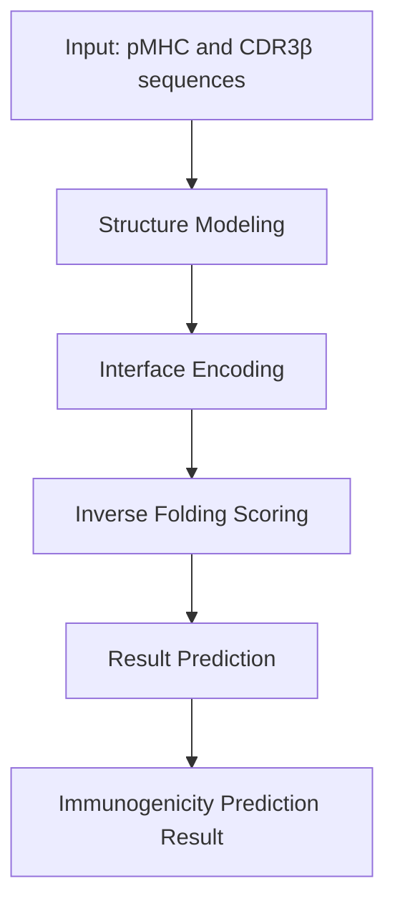

# ImmunBert: Immunogenicity Prediction Tool

ImmunBert is a deep learning-based immunogenicity prediction tool that combines structural biology and sequence analysis techniques to predict the binding capability of T cell receptor (TCR) CDR3β regions with peptide-MHC (pMHC) complexes, thereby assessing their immunogenicity.


## Workflow



### 1. Structure Modeling
Use PANDORA to build the 3D complex structure of pMHC and CDR3β.

**Input**: pMHC sequence, CDR3β sequence  
**Output**: Complex structure file (PDB format)  
**Module**: `src/structure/modeling.py`

### 2. Interface Encoding
Use MaSIF to extract geometric and chemical properties on the contact surface between pMHC and CDR3β to generate high-dimensional fingerprint features.

**Input**: Complex structure file  
**Output**: Interface feature vector  
**Module**: `src/interface/encoding.py`

### 3. Inverse Folding Scoring
Use ProteinMPNN's scoring mode to calculate the conditional probability or perplexity of the input CDR3β sequence under fixed backbone structure.

**Input**: Complex structure file, CDR3β sequence  
**Output**: Sequence scoring (log-likelihood, perplexity, etc.)  
**Module**: `src/model/scoring.py`

### 4. Result Prediction
Classify based on the scores output by ProteinMPNN. Higher scores (or lower perplexity) indicate that the CDR3β sequence is more suitable for the current pMHC interface, predicting its immunogenicity.

**Input**: Sequence scoring, interface features  
**Output**: Immunogenicity prediction result  
**Module**: `src/model/prediction.py`

## Project Structure

```
ImmunBert/
├── src/                    # Source code directory
│   ├── structure/         # Structure modeling module
│   │   └── modeling.py    # Structure modeling implementation
│   ├── interface/         # Interface encoding module
│   │   └── encoding.py    # Interface feature extraction implementation
│   ├── model/             # Model related modules
│   │   ├── scoring.py     # Inverse folding scoring implementation
│   │   └── prediction.py  # Result prediction implementation
│   └── utils/             # Utility functions
├── tests/                 # Test code
│   ├── test_structure_modeling.py
│   ├── test_interface_encoding.py
│   ├── test_inverse_folding.py
│   └── test_prediction.py
├── data/                  # Training data (user provided)
├── model/                 # Model weights (user provided)
├── environment.yml        # Conda environment configuration file
└── README.md             # Project documentation
```

## Installation

```bash
# Create Conda environment
conda env create -f environment.yml

# Activate environment
conda activate immunbert

# Or install dependencies using pip
pip install -r requirements.txt
```

## Usage

### 1. Prepare Data
Place training data in the `data/` directory and model weights in the `model/` directory.

### 2. Run Prediction
```python
from src.structure.modeling import StructureModeler
from src.interface.encoding import InterfaceEncoder
from src.model.scoring import InverseFolder
from src.model.prediction import ImmunogenicityPredictor

# Initialize modules
modeler = StructureModeler()
encoder = InterfaceEncoder()
scorer = InverseFolder()
predictor = ImmunogenicityPredictor()

# Example sequences
pmhc_sequence = "SIINFEKL.A.B"
cdr3b_sequence = "CASSLGQGDNIQYF"

# 1. Structure modeling
structure_path = modeler.build_complex_structure(pmhc_sequence, cdr3b_sequence)

# 2. Interface encoding
interface_features = encoder.extract_interface_features(structure_path)

# 3. Inverse folding scoring
scoring_results = scorer.score_sequence(structure_path, cdr3b_sequence)

# 4. Result prediction
features = predictor.prepare_features(scoring_results, interface_features)
prediction_result = predictor.predict(features)

print(f"Immunogenicity probability: {prediction_result['probability']}")
print(f"Prediction result: {'Immunogenic' if prediction_result['prediction'] else 'Non-immunogenic'}")
```

## Testing

Run unit tests:

```bash
python -m pytest tests/
```

## License

This project is licensed under the MIT License. See the [LICENSE](LICENSE) file for details.

## Development Team

- Project Lead: [Your Name]
- Team Members: [Team Members]

## Acknowledgements

This project uses the following open-source tools and libraries:
- [PANDORA](https://github.com/EleutherAI/pandora) - Protein complex structure modeling
- [MaSIF](https://github.com/LPDI-EPFL/masif) - Protein interface feature extraction
- [ProteinMPNN](https://github.com/dauparas/ProteinMPNN) - Protein sequence design and scoring